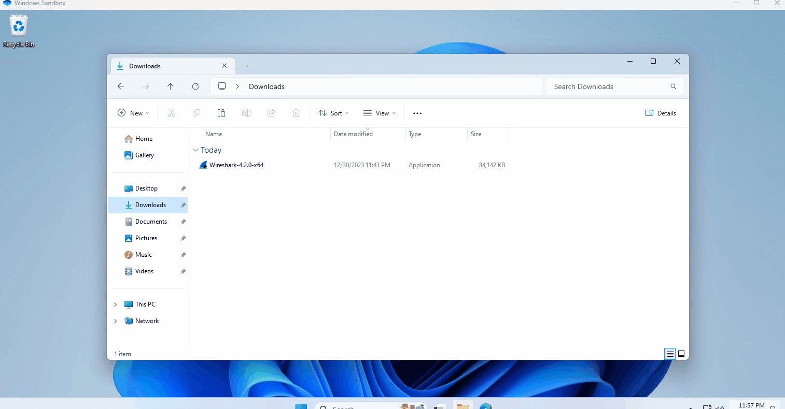

# 📱Telegram-Grabber-Windows📱

`Telegram-Grabber-Windows` is a tool designed to capture and analyze network packets to determine the IP address of an interlocutor in the Telegram messenger. This tool is particularly useful for network analysis and cybersecurity purposes.

## Features

- Capture STUN (Session Traversal Utilities for NAT) packets to identify IP addresses related to Telegram calls.
- Exclude specific IP ranges associated with Telegram servers.
- Retrieve WHOIS information for identified IP addresses.
- Display hostname and location information for each IP address.
- User-friendly interface for selecting network interfaces.
- Built for Windows environments with an executable file for easy usage.

## Prerequisites

  

- Wireshark must be installed on your system, specifically `tshark`, which is used for packet capturing. During the installation of Wireshark, ensure it is installed in the default location and that `tshark` is enabled.
- Python 3.x should be installed if you are running the script directly.
- Internet connection for fetching WHOIS data.

## Usage

  

### Using the Executable

1. Grab the release from here [RELEASE](https://github.com/pentestfunctions/Telegram-Grabber-Windows/releases/tag/Telegram)
2. Run `telegrabber.exe`.
3. Select the network interface you want to use for capturing packets.
4. Initiate a Telegram call.
5. The tool will capture packets and display relevant IP information and WHOIS data.

### Using the Python Script

1. Open a command prompt or terminal.
2. Navigate to the directory containing `telegrabber.py`.
3. Run the script using `python telegrabber.py`.
4. Follow the on-screen instructions similar to the executable usage.

## Inspiration
- Based on this code
- https://github.com/n0a/telegram-get-remote-ip

`Telegram-Grabber-Windows` is intended for educational and ethical testing purposes only. Users are responsible for complying with all applicable laws and regulations in their respective jurisdictions while using this tool.
